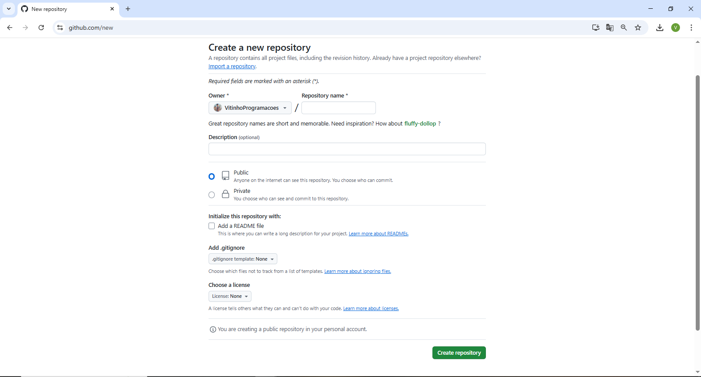
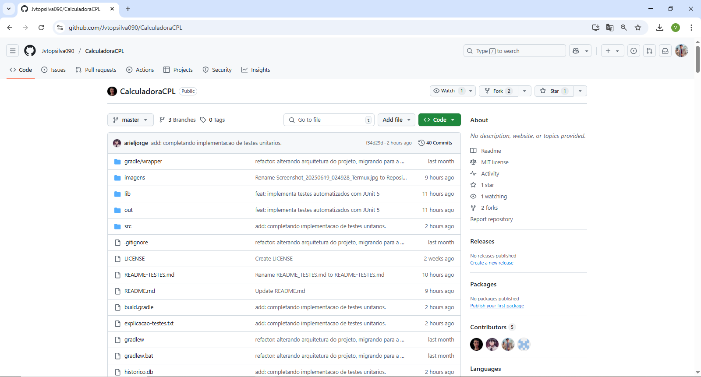
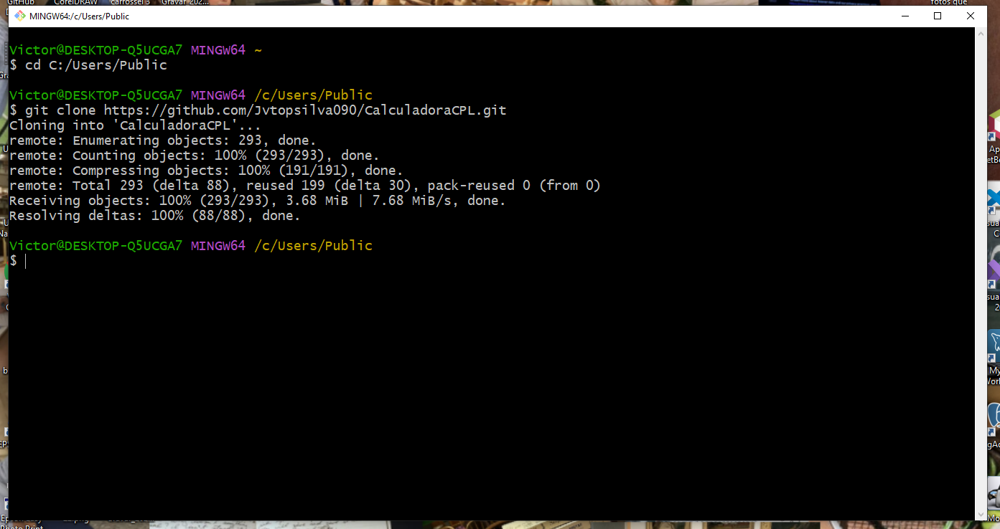
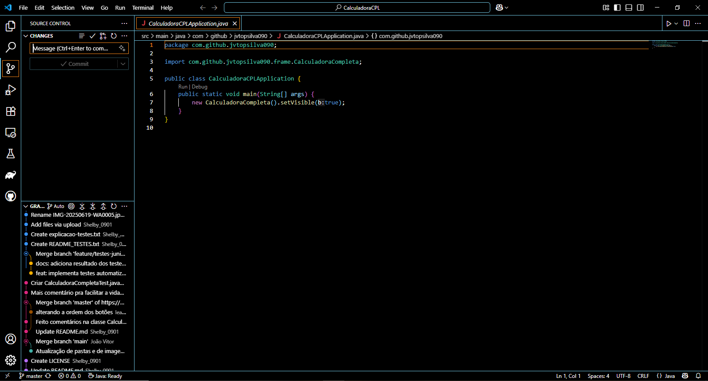

## Introdução

Nesse Projeto Integrador, desenvolvemos uma calculadora com um grau de complexidade um pouco mais elevado - contendo interface visual, banco de dados para o armazenamento dos cálculos e resultados e testes automatizados via JUnit 5. O projeto inteiro foi concluído utilizando o fluxo de trabalho git (Gitflow) a fim de simular um projeto real com boas práticas de versionamento e foram realizados também testes unitários pelo JUnit para assegurar a qualidade do software final.

---

A princípio, para iniciar os trabalhos pelo GitHub, é preciso criar uma conta. Isso será feito apertando no botão "Criar uma conta" no campo direito superior da tela do site github.com.


---

Preencha os campos Email, Password, Username, escolha seu país atual e concorde com os termos marcando a checkbox acima do botão "Continue". Ao fim desse processo, basta clicar em Continue e sua conta estará criada.


---

Após atravessar todos os pop-ups de boas vindas do GitHub, a tela inicial será semelhante a essa:


Aqui você pode explorar as novidades da comunidade, fazer postagens e até mesmo ler Trends de seu interesse, e etc. Sinta-se livre para explorar! Entretanto, o que nos importa no momento é o botão verde "New" localizado no canto esquerdo da tela. Por lá será criado um novo repositório onde poderemos trabalhar no nosso projeto.

---



Aqui iremos nomear o repositório - "Repository name" -, descrevê-lo - "Description" -, decidir se ele será público ou privado por meio das opções "Public" e "Private", escolher adicionar um arquivo de texto com especifições sobre o projeto e podemos até mesmo adicionar o arquivo .gitignore que, conforme especificado pelos usuários, ignorará certos arquivos no fluxo do git. Com as informações preenchidas corretamente, podemos clicar no botão "Create repository" e pronto, repositório criado!

---

Depois da criação e exportação de todos os arquivos da calculadora programada em Java, essa será extamanete a cara do nosso repositório:



---

Mas e agora? O que precisamos fazer para rodar na nossa IDE? E a resposta é clonar o repositório em nossa máquina pelo comando git clone. Para executá-lo, baixa fazer download do Git em sua máquina e abrir o Git Bash, executar os comandos "cd <diretório desejado>", para abrir a pasta que receberá os arquivos, e depois ```git clone https://github.com/Jvtopsilva090/CalculadoraCPL.git```.



---

Com o repositório na nossa máquina, abriremos nossa IDE de preferência - nesse caso foi escolhido o Visual Studio Code - e pelo caminho File>Open Folder podemos selecioná-lo.


---

Feito isso, nosso repositório já está aberto na IDE. Vale ressaltar que para ele funcionar, a máquina precisa ter instalada o Java Development Kit (JDK) e, para ser possível trabalhar com o Git dentro da IDE, uma extensão também sera necessária no github.


