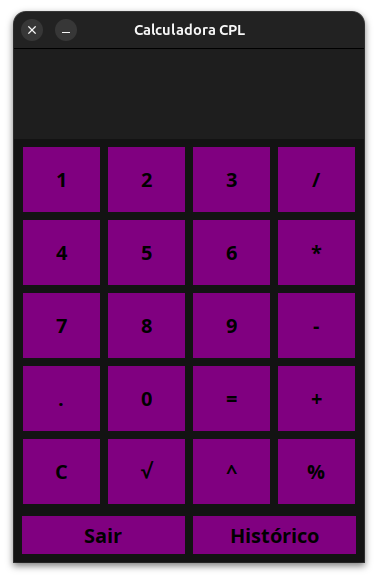
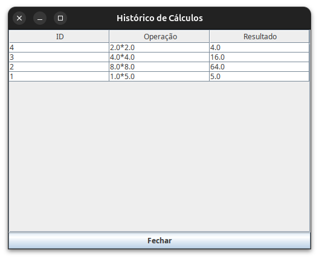
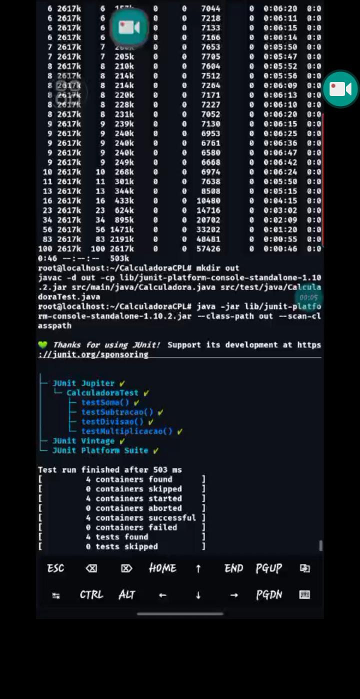
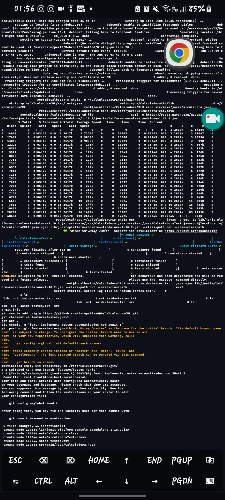
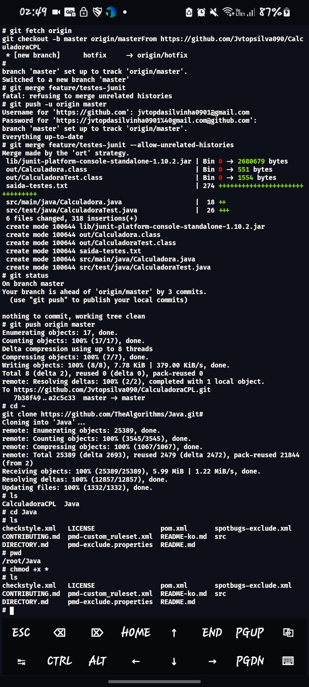

# 📱 CalculadoraCPL

Este é um projeto de **Calculadora desenvolvida em Java**, com interface gráfica simples, desenvolvido para fins acadêmicos na disciplina de CPL. O objetivo é criar uma aplicação funcional que realize operações matemáticas básicas, de forma intuitiva e objetiva.

---

## **_🛠️ Tecnologias Utilizadas_**

- **Java** (Linguagem principal)
- **Swing** (Interface gráfica)
- **NetBeans / VS Code / IntelliJ**
- **JDK 17/21** ou superior

---

## **_⚙️ Funcionalidades_**

- **Operações básicas:**
  - **Soma**
  - **Subtração**
  - **Multiplicação**
  - **Divisão**
- **Limpar campos**
- **Interface amigável e intuitiva**
- **Sistema de tratamento de erros**
- **Historico de Calculos**
- **Banco de dados local**

---

## **_🚀 Como Executar o Projeto_**

### **_✅ Pré-requisitos_**

- **Java JDK instalado (versão 17 ou superior)**
- **Uma IDE que suporte Java**

### **_▶️ Passo a passo_**

## _1. Clone o repositório:_

```bash
 git clone https://github.com/Jvtopsilva090/CalculadoraCPL.git
```

## **_Abra o projeto na sua IDE de preferência_.**

## _2. Execute o arquivo principal:_

```bash
  Calculadora.java
```

## **_Utilize normalmente a calculadora._**

---

## 💻 _**Imagens da Interface**_

## Calculadora em execução



---

## Historico dos Calculos:




---

## Prints dos testes Feitos no JUnit5
(Utilizei O termux-Debian para rodar o JUnit5 para fazer os teste, releve a imagens de baixa qualidade)


## Print De Teste Feito com Sucesso:





---

## Print Subindo para o GitHub:





---


## Print de Adicionando um Repositório Externo:




---


## 🔧 Estrutura do Projeto

```plaintext
CalculadoraCPL/
├── imagens/                          # Pasta com imagens usadas no README
│   ├── CalculadoraCPL.png
│   └── HistoricoDeCalculos.png
│
├── src/                               # Código-fonte Java
│   └── main/
│       └── java/
│           └── com/
│               └── github/
│                   └── jvtopsilva090/
│                       ├── Calculadora.java         # Classe principal da calculadora
│                       ├── Historico.java           # (Exemplo) Classe para histórico de cálculos
│                       └── ...                      # Outras classes, se existirem
│
├── README.md                          # Documentação do projeto
├── .gitignore                         # Arquivos e pastas ignorados pelo Git
├── LICENSE                             # Licença do projeto
└── CalculadoraCPL.iml                  # Arquivo de configuração da IDE (IntelliJ, opcional)

```

---

## 👨‍💻 Colaboradores

- 🧑‍💻 João Vitor Ferreira da Silva - 
- [@Jvtopsilva090](https://github.com/Jvtopsilva090)
- 🧑‍💻 ARIEL JORGE DA SILVA - 
- [@arieljorge](https://github.com/arieljorge)
- 🧑‍💻 LEANDRO BATISTA DE SOUSA GALDINO - 
- [@leandrogaldinow](https://github.com/leandrogaldinow)
- 🧑‍💻 Pedro Nunes Marques Junior - 
- [@penuma0960](https://github.com/penuma0960)
- 🧑‍💻 Victor Hugo Batista Pereira - 
- [@VitinhoProgramacoes](https://github.com/VitinhoProgramacoes)
- 
---

## 📝 Licença

Este projeto está sob a licença **MIT**. 
Consulte o arquivo [**_Licença_**](./LICENSE) para mais informações.


---

## 🔗 Links Úteis

- [Download do Java](https://www.oracle.com/java/technologies/javase-jdk17-downloads.html)
- [GitHub](https://github.com/Jvtopsilva090)

---

## 🏗️ Melhorias Futuras

- Adicionar operações avançadas
- Melhorias na interface
- Adaptação para web ou mobile
