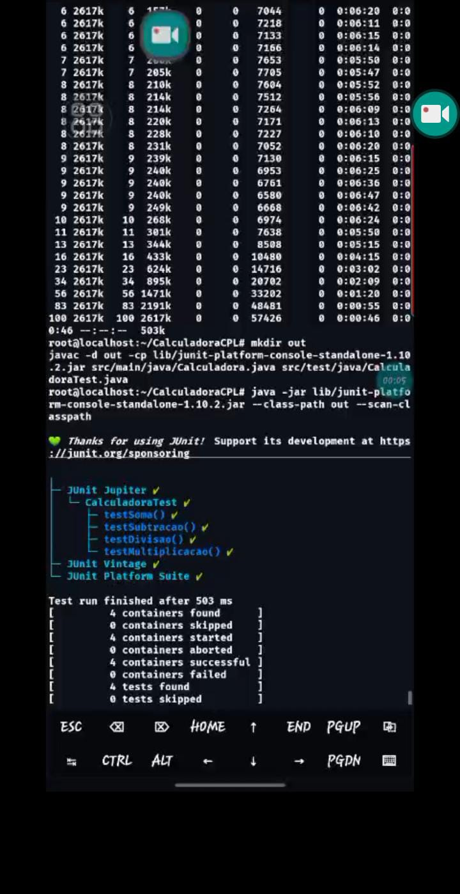

Este arquivo documenta os testes realizados na CalculadoraCPL.

- Foram criadas as classes:
  - src/main/java/Calculadora.java → Contém as operações matemáticas
  - src/test/java/CalculadoraTest.java → Contém os testes unitários JUnit 5

- O JUnit foi baixado via:
  lib/junit-platform-console-standalone-1.10.2.jar

- Compilação dos testes:
  javac -d out -cp lib/junit-platform-console-standalone-1.10.2.jar src/main/java/Calculadora.java src/test/java/CalculadoraTest.java

- Execução:
  java -jar lib/junit-platform-console-standalone-1.10.2.jar --class-path out --scan-classpath

- Resultado salvo em:
  saida-testes.txt

Todos os testes passaram com sucesso ✅.

---

## Prints dos testes Feitos no JUnit5
(Utilizei O termux-Debian para rodar o JUnit5 para fazer os teste, releve a imagens de baixa qualidade)

---

---
